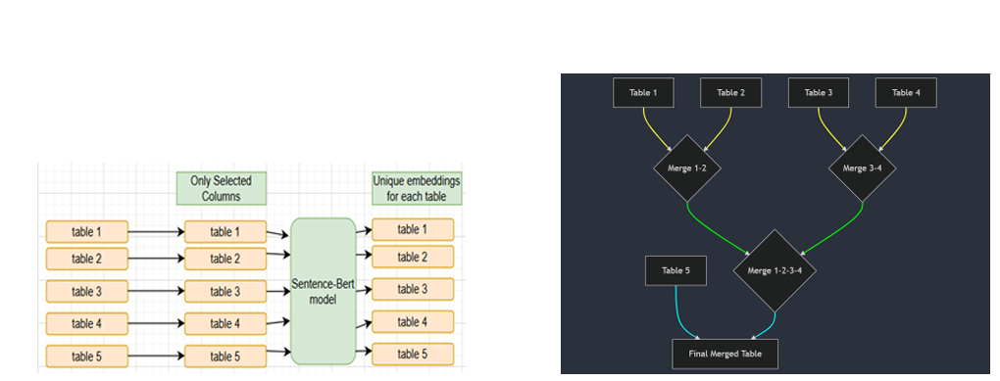

# 🎯 Unsupervised-Entity-Matching  
**Bridging the Gap: Efficient Unsupervised Entity Matching Across Multiple Tables**

## 🔍 Overview
This project presents a robust framework for **unsupervised entity matching** across multiple heterogeneous datasets using **semantic embeddings** and **intelligent record linking**. It is optimized for scalability and accuracy in data integration tasks.



## ✨ Key Features
- ✅ Intelligent attribute selection using distance-based heuristics  
- 🧠 Semantic embedding using `SentenceTransformer`  
- 🔗 Record merging via k-nearest neighbor (KNN) search  
- 🧹 Outlier pruning with density-based clustering (similar to DBSCAN)  

---

## 📁 Folder Structure

```text
Code Scripts/
├── data/
│   ├── Music_20/
│   │   ├── table_0.csv
│   │   ├── table_1.csv
│   │   └── ...
│   └── Music_200/
│       ├── table_0.csv
│       ├── table_1.csv
│       └── ...
```

---

## 📓 Jupyter Notebook: `final_script_pysc_681.ipynb`

> This notebook runs on the **Music_20** dataset (~8 mins on GPU in Narnia).  
> For **Music_200**, see `final_script_music_200.ipynb` (~35 mins runtime).

### 🧪 Required Libraries
```bash
pip install numpy pandas sentence-transformers hnswlib scikit-learn torch tqdm loguru
```

### 📜 Notebook Sections (Compressed for Navigation)
1. Import Libraries  
2. Set GPU  
3. `Table` Class – Preprocess CSVs  
4. `Timer` – Measure runtime  
5. Logging setup  
6. Approximate Nearest Neighbors (HNSWlib)  
7. `MainArgs` – Parameter configuration  
8. Attribute selector  
9. Table-wise hierarchical merging using KNN  
10. `Pruner` – Outlier removal  
11. `Metric` – Computes F1 & Pairwise-F1  
12. Main process pipeline  
13. Visualization of clusters  

---

## 🚀 How to Run

1. Set your **GPU ID** at the top.
2. In the `MainArgs` section:
   - Set `data_path` to the folder where `Music_20` or `Music_200` resides.
   - Set `data_name` to `Music_20` or `Music_200`.
3. Run all cells to execute the full pipeline:
   - ✅ Read tables  
   - 🔍 Select important attributes  
   - 🧠 Generate embeddings  
   - 🔗 Merge records with KNN  
   - 🧹 Prune outliers  
   - 📊 Evaluate performance  
   - 📈 Visualize clusters  

---

## 📊 Results

| Dataset     | Precision (%) | Recall (%) | F1 (%) | Pairwise-F1 (%) |
|-------------|---------------|------------|--------|------------------|
| Music-20    | 81.98         | 82.82      | 82.40  | 92.66           |
| Music-200   | 75.47         | 77.14      | 76.29  | 89.73           |

> 📌 *Pairwise-F1* offers a relaxed evaluation by assessing record pair similarity instead of exact tuple matching.

---

## 🔮 Future Work
- Explore advanced or domain-specific embedding models  
- Investigate knowledge-graph based similarity  
- Improve scalability and memory efficiency  

---

## 👤 Author
**Raga Lagudua Ganesan**  
Graduate Student – Data Science  
Rochester Institute of Technology  
📧 rl1158@rit.edu
